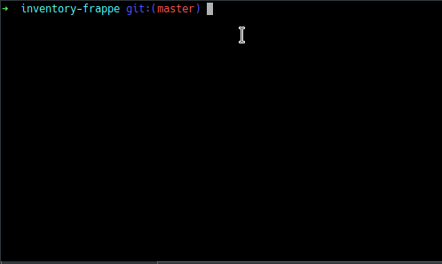
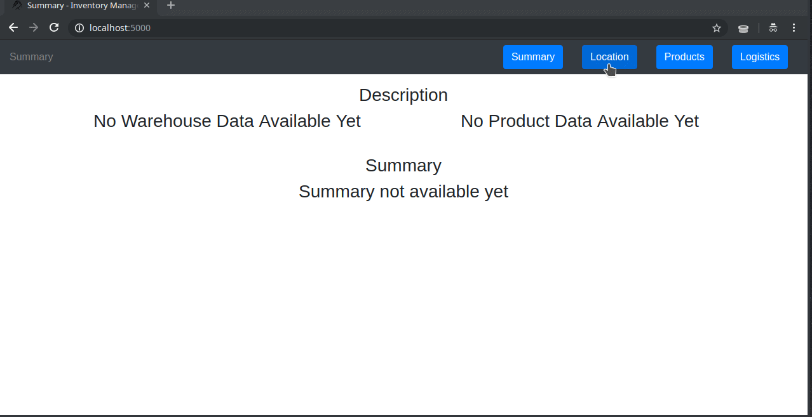
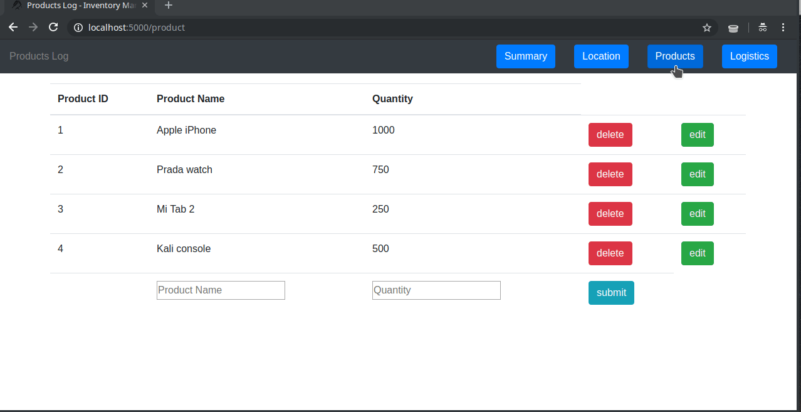

# Inventory Management System

*"Simple Inventory Management System powered by Flask"*

## Table of Contents

  - [Installation](#installation)
  - [Overview](#overview)
  - [Usage](#usage)
    - [Starting Things Up](#starting-things-up)
    - [Getting Into It](#getting-into-it)
        - [Inserting products and locations](#adding-products-and-locations)
        - [Moving things around](#moving-things-around)
        - [Editing Existing Data](#editing-existing-information)
  - [Dependencies](requirements.txt)
  - [License](#license)

## Installation

Clone the git
repository:

``` sourceCode console
$ git clone https://github.com/gavindsouza/inventory-management-system.git
$ cd inventory-management-system
```


Install necessary dependencies

``` sourceCode console
$ pip3 install -r requirements.txt
```

which is actually the same as

``` sourceCode console
$ pip3 install flask
```


## Overview

The _index page_ or _summary_ covers the summary of the system containing lists of products and location along with a count of unallocated products.
On the _products page_, we can add/edit/remove products from the system. The _location page_ covers similar functionality in the context of locations or warehouses.
On the _logistics  page_, movement of products can be performed. It also maintains the history of all transactions in a tabular form.

## Usage

### Starting Things Up

To run the application, change the current working directory to
\~/inventory-management-system/inventory/

``` sourceCode console
$ cd inventory
```

run the app by typing the following command in your terminal

``` sourceCode console
$ python3 -m flask run
```



The application can be accessed at _localhost:5000_ in your browser


This view of the system can be accessed for demo purposes on installation, to start afresh remove thr inventory.db file from the parent folder


### Getting Into It

A new system will look like this


#### Adding Products and Locations

To add products, only the name and quantity are required
Adding locations needs only the name to be added



#### Moving Things Around

Products can be moved into and between warehouses after they have been added to the system


"Moving into locations"


"Moving between locations"

#### Editing Existing Information

Editing Product Information



Editing Location Information


Deleting Products and Locations on the System


## Dependencies

  - Just Flask\!

## License

This code has been released under the [MIT License](LICENSE).
